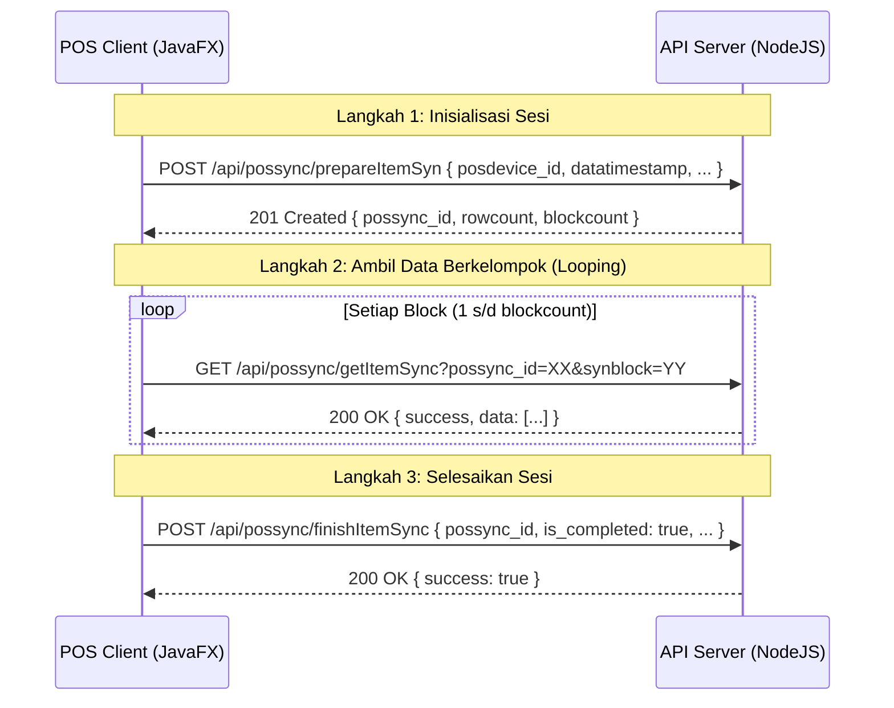

# Dokumentasi API - POS Item Synchronization

Dokumen ini berisi spesifikasi teknis dan panduan integrasi untuk endpoint sinkronisasi item yang didefinisikan pada [posSyncRoutes.js](file:///Volumes/Development/transfashion/jfxpos-api/src/routes/posSyncRoutes.js). API ini digunakan oleh aplikasi klien **jfxpos** (Java 25 / JavaFX 25) untuk memperbarui data item lokal secara bertahap (chunked/block).

---

## 🔒 Keamanan & Autentikasi (M2M)

Seluruh endpoint pada rute ini terproteksi menggunakan verifikasi **Machine-to-Machine (M2M) API Key & Signature**. Setiap request wajib melampirkan header berikut:

| Header Key | Tipe | Deskripsi | Contoh |
| :--- | :--- | :--- | :--- |
| `X-Device-Code` | String | Kode identitas unik perangkat POS | `pos-kasir-01` |
| `X-API-Key` | String | API Key unik perangkat | `key_kasir_satu_123` |
| `X-Timestamp` | String | Waktu UTC (ISO 8601) pengiriman request | `2026-07-06T13:51:02.270Z` |
| `X-Signature` | String | HMAC-SHA256 dari payload `JSON.stringify(body) + timestamp` menggunakan `secret` | `b53f7c32e98fa...` |
| `X-Site-Code` | String | Kode Cabang (Site) tempat perangkat beroperasi | `SITE01` |
| `X-Dept-Code` | String | Kode Departemen perangkat POS | `DEPT01` |

---

## 📌 Alur Kerja Sinkronisasi (Sync Workflow)



---

## 1. Prepare Item Sync

Menginisialisasi sesi sinkronisasi item baru dan menyiapkan data item yang perlu di-sync ke tabel penampungan sementara (`itemsync`).

* **Endpoint**: `/api/possync/prepareItemSyn`
* **Metode**: `POST`

### Request Body
```json
{
  "posdevice_id": 1,
  "client_timestamp": "2026-07-06T13:51:02.270Z",
  "datatimestamp": "2026-07-05T05:03:32.124Z"
}
```
* **Keterangan**:
  * `datatimestamp`: Menggunakan `0` jika ingin menarik seluruh data dari awal (Full Sync), atau ISO 8601 UTC timestamp jika ingin menarik perubahan terbaru saja (Incremental Sync).

### Response Sukses (201 Created)
```json
{
  "success": true,
  "message": "Persiapan sinkronisasi berhasil disimpan.",
  "data": {
    "possync_id": "24",
    "rowcount": 120,
    "blockcount": 3
  }
}
```

---

## 2. Get Item Sync Block

Mengambil data item berdasarkan nomor blok halaman (`synblock`) pada sesi sinkronisasi tertentu.

* **Endpoint**: `/api/possync/getItemSync`
* **Metode**: `GET`
* **Query Parameters**:
  * `possync_id` (Integer - Wajib)
  * `synblock` (Integer - Wajib)

> [!NOTE]
> Untuk kalkulasi Signature HMAC pada request `GET`, parameter payload stringified body menggunakan string kosong `{}` karena request `GET` tidak memiliki body payload.

### Response Sukses (200 OK)
```json
{
  "success": true,
  "possync_id": 24,
  "synblock": 1,
  "count": 2,
  "data": [
    {
      "item_id": "1001",
      "item_code": "ITM-001",
      "name": "Kemeja Flanel Slim Fit",
      "price": 250000,
      "md5hash": "d41d8cd98f00b204e9800998ecf8427e",
      "datatimestamp": "2026-07-05T05:10:00.000Z",
      "synnumber": "1",
      "synblock": "1",
      "barcodes": [
        {
          "itembarcode_id": "1",
          "itembarcode_isdisabled": false,
          "item_id": "1001",
          "barcode": "8991234567890",
          "brand_id": 2,
          "created_at": "2026-07-05T05:10:00.000Z",
          "datatimestamp": "2026-07-05T05:10:00.000Z"
        }
      ]
    },
    {
      "item_id": "1002",
      "item_code": "ITM-002",
      "name": "Celana Chino Black",
      "price": 320000,
      "md5hash": "8c545084bc606f35b2e5912d08a542b8",
      "datatimestamp": "2026-07-05T05:12:30.000Z",
      "synnumber": "2",
      "synblock": "1",
      "barcodes": []
    }
  ]
}
```

---

## 3. Finish Item Sync

Menutup sesi sinkronisasi dan memperbarui status akhir sesi sinkronisasi pada database pusat.

* **Endpoint**: `/api/possync/finishItemSync`
* **Metode**: `POST`

### Request Body
```json
{
  "possync_id": 24,
  "is_completed": true,
  "is_error": false,
  "errormessage": ""
}
```

### Response Sukses (200 OK)
```json
{
  "success": true,
  "message": "Status sinkronisasi berhasil diperbarui."
}
```
